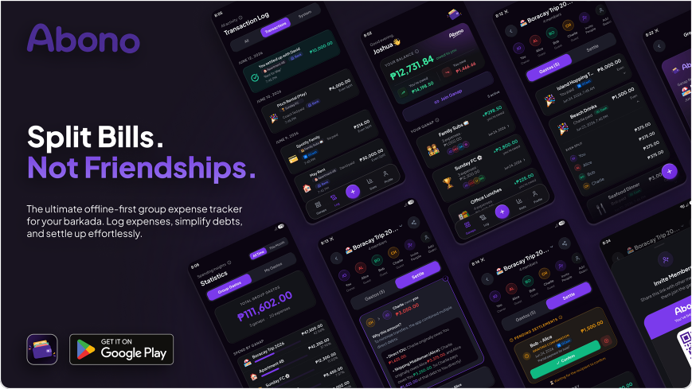

<!-- ═══════════════════════════════════════════════════════════════════════════ -->
<!--                        GITHUB PROFILE README                             -->
<!--                     Glenn Joshua Corpus (@gjcodess)                      -->
<!-- ═══════════════════════════════════════════════════════════════════════════ -->

 

<!-- ─── ABOUT ME ─── -->

<h3 align="center">🧑‍💻 About Me</h3>

  

<!-- ─── GITHUB STATS ─── -->

<h3 align="center">📊 GitHub Stats</h3>

<!-- ─── TECH STACK ─── -->

<h3>🛠️ Tech Stack</h3>

<!-- ─── FEATURED PROJECTS ─── -->

<h3>🚀 Featured Projects</h3>

<!-- ─── EXPERIENCE & EDUCATION ─── -->

<h3>💼 Experience &amp; Education</h3>

<!-- ─── CONNECT WITH ME ─── -->

<h3 align="center">🤝 Connect With Me</h3>

&nbsp;

&nbsp;

 

&nbsp;

&nbsp;

&nbsp;

 

